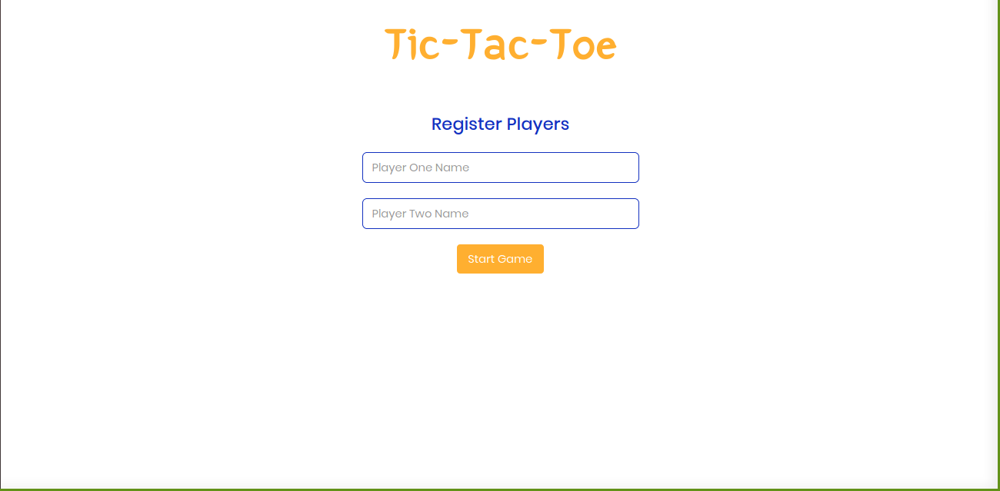
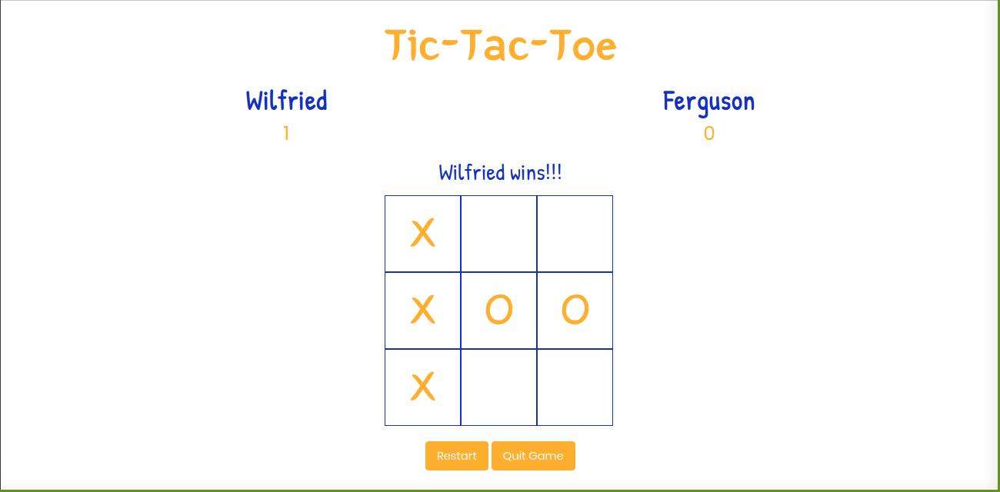
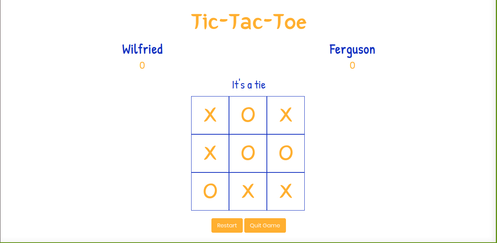

[![Contributors][contributors-shield]][contributors-url]
[![Issues][issues-shield]][issues-url]
 

 
  <h3 align="center">Tic-Tac-Toe</h3>
  

    Factory Functions And Modules
     
    <a href="https://github.com/fegzycole/Tic-Tac-Toe-js"><strong>Explore the docs »</strong></a>
     
     
    ·
    <a href="https://github.com/fegzycole/Tic-Tac-Toe-js">Report Bug</a>
    ·
    <a href="https://github.com/fegzycole/Tic-Tac-Toe-js">Request Feature</a>
  

<!-- TABLE OF CONTENTS -->
## Table of Contents

* [About the Project](#about-the-project)
* [Screenshots](#screenshots)
* [Use](#use)
* [Roadmap](#roadmap)
* [License](#license)
* [Contact](#contact)

<!-- ABOUT THE PROJECT -->
## About The Project

This project tests the understanding of factory functions and modules in Javascript.

Full task description: [Here](https://www.theodinproject.com/courses/javascript/lessons/factory-functions-and-the-module-pattern).

## Screenshots

### Built With

This project was built with Javascript

## Getting Started

- git clone https://github.com/fegzycole/Tic-Tac-Toe-js.git

- cd Tic-Tac-Toe-js

- Open the index.html file in any web browser of your choosing.

## Live Version

- You can view the app [Here](https://github.com/fegzycole/Tic-Tac-Toe-js/)

<!-- ROADMAP -->
## Roadmap

See the [open issues](https://github.com/fegzycole/Tic-Tac-Toe-js/issues) for a list of proposed features (and known issues).

<!-- CONTACT -->
## Contact
Wilfried Canirinka

* [Github profile](https://github.com/WCanirinka)

* [Twitter](https://twitter.com/WCanirinka )

Ferguson Iyara
* [Github profile](https://github.com/fegzycole)

* [Twitter](https://twitter.com/fergusoniyara)

Project Link: [Project repo](https://github.com/fegzycole/Tic-Tac-Toe-js)

<!-- MARKDOWN LINKS & IMAGES -->
<!-- https://www.markdownguide.org/basic-syntax/#reference-style-links -->
[contributors-shield]: https://img.shields.io/badge/Contributors-2-%2300ff00
[contributors-url]: https://github.com/fegzycole/Tic-Tac-Toe-js/graphs/contributors
[issues-shield]: https://img.shields.io/badge/issues-0-%2300ff00
[issues-url]: https://github.com/fegzycole/Tic-Tac-Toe-js/issues/